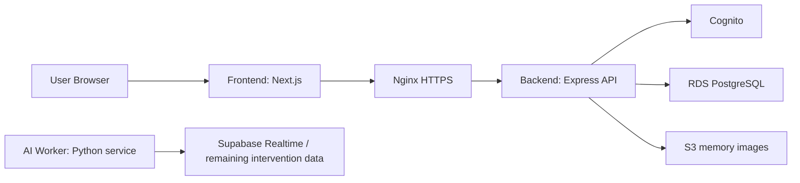

# Moodot Architecture

## 1. Current deployment structure

Moodot is currently split into three responsibilities:

- `FE`: Next.js app for the user interface
- `BE`: Express backend for API orchestration
- `AI`: Python worker under `service/`

The frontend no longer needs to call Supabase directly for the main separated domains. In the current EC2 deployment it talks to the backend API through Nginx, and the backend uses Cognito for auth, RDS PostgreSQL for the core record data, and S3 for newly uploaded memory images.



At runtime, the frontend and backend are managed as separate PM2 processes:

- `moodot-fe`
- `moodot-be`

## 2. Separated domains

The following domains are already moved to the backend API layer:

- `memories`
- `collections`
- `interventions`
- `ai-insight` state lookup
- image upload / signed URL flow

This means the main access pattern is now:

```text
Browser -> Nginx HTTPS -> Frontend -> Backend API -> RDS PostgreSQL / S3
```

instead of:

```text
Frontend -> Supabase directly
```

The remaining Supabase path is mainly the AI intervention workflow and compatibility fallback code.

## 3. Runtime ports

Local development:

- Frontend: `http://localhost:3000`
- Backend: `http://localhost:4000`

EC2 deployment:

- Public site: `https://mood-ot.com`
- Elastic IP: `15.164.114.242`
- Frontend process listens behind Nginx
- Backend process listens behind Nginx for `/api` and health routes

PM2 process names:

- `moodot-fe`
- `moodot-be`

## 4. Environment variables

Frontend / backend runtime currently depend on these core variables:

```env
NEXT_PUBLIC_SUPABASE_URL=
NEXT_PUBLIC_SUPABASE_ANON_KEY=
SUPABASE_SERVICE_ROLE_KEY=
MEMORY_TEXT_ENCRYPTION_KEY=
NEXT_PUBLIC_API_BASE_URL=
FRONTEND_ORIGIN=
NEXT_PUBLIC_AUTH_PROVIDER=
AUTH_PROVIDER=
NEXT_PUBLIC_COGNITO_DOMAIN=
NEXT_PUBLIC_COGNITO_CLIENT_ID=
COGNITO_DOMAIN=
COGNITO_CLIENT_ID=
COGNITO_REGION=
COGNITO_USER_POOL_ID=
DB_HOST=
DB_PORT=
DB_NAME=
DB_USER=
DB_PASSWORD=
DATABASE_SSL=
S3_BUCKET=
S3_REGION=
```

Notes:

- `NEXT_PUBLIC_API_BASE_URL` must match the backend address used by the frontend.
- `FRONTEND_ORIGIN` must match the frontend origin allowed by the backend CORS config.
- `MEMORY_TEXT_ENCRYPTION_KEY` is required for encrypted memory text read/write.
- In production, `NEXT_PUBLIC_API_BASE_URL=https://mood-ot.com` and Nginx proxies API traffic to the Express backend.
- `S3_BUCKET` and `S3_REGION` enable S3 uploads. Without them, the backend falls back to Supabase Storage.

## 5. CI workflow split

GitHub Actions are split by responsibility:

- `ai-worker-ci.yml`: runs only when `service/**` changes
- `fe-be-ci.yml`: runs for frontend/backend changes and ignores `service/**`

This prevents FE/BE pushes from unnecessarily triggering AI image build logic.

## 6. Remaining work

The architecture is in a strong "phase 1 complete" state, but not fully finished yet.

Remaining candidates:

- Deploy and verify the RDS SQL path for `interventions` and `intervention_feedback`.
- Deploy AI worker through ECS or another isolated runtime
- Replace AI Worker Supabase Realtime dependency with SQS/EventBridge or another AWS-native event path.
- Add production deployment steps to the new CI workflows

## 7. Verification completed

The following checks have already been verified during deployment work:

- frontend and backend run independently on EC2
- Cognito Hosted UI and Google login work on `https://mood-ot.com`
- `memories` and `collections` persist through RDS PostgreSQL
- new image uploads persist to S3 bucket `moodot-memory-images-jungho-2026`
- image signed URL retrieval works on memory detail pages
- PM2 auto-start restores both processes after EC2 reboot
- Elastic IP keeps the public endpoint stable across instance restarts

## 8. Why this structure

This split improves:

- maintainability: UI and API responsibilities are clearer
- deployability: frontend and backend can be restarted independently
- portfolio value: the project shows explicit FE/BE/AI separation instead of a single bundled app
- future migration flexibility: Supabase can remain as the data platform while the app logic moves into our own backend
